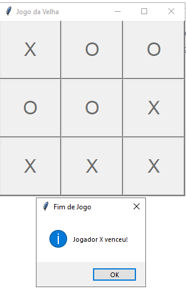

# 🎮 Jogo da Velha em Python



Um clássico Jogo da Velha desenvolvido em Python com interface gráfica usando Tkinter.

## 🚀 Recursos
- Interface amigável com Tkinter
- Indicação do jogador atual (X ou O)
- Detecção automática de vitória/empate
- Menu para reiniciar o jogo

## ⚙️ Como Executar
1. Certifique-se de ter Python instalado (versão 3.x)
2. Clone o repositório:
   ```bash
   git clone https://github.com/LipePrieto/jogo-da-velha-tkinter.git
